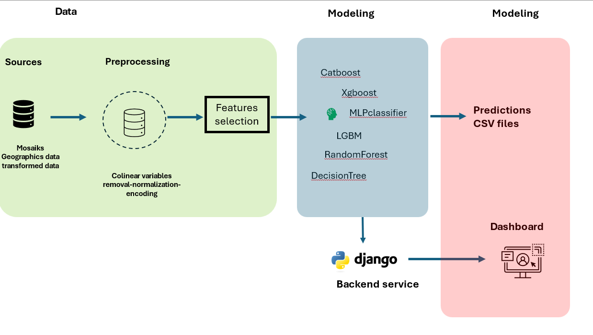

## Architecture

<figure markdown="span">

    <figcaption>Diagram</figcapption>
</figure>

## **ETL process**
# Data Reading

In this step, we read data from CSV files and concatenate them into a single DataFrame.

```python
import pandas as pd

# Read data from different CSV files
data = pd.read_csv("../../data/Train.csv")
data_2 = pd.read_csv("../../data/train_2.csv", encoding='utf-8')
test_data = pd.read_csv("../../data/Test.csv")

# Concatenate data into a single DataFrame
data = pd.concat([data, data_2], ignore_index=True)
```
# Data Preprocessing

In this step, we perform preprocessing on the data by handling missing values and selecting relevant features.

```python
# Remove a specific row and an ID column
data = data.drop(14385).reset_index(drop=True)
data = data.drop(columns=['ID'])
test_data = test_data.drop(columns=['ID'])

# Select numeric features
numeric_data = data.select_dtypes(include=[np.number])
```
# Feature Collinearity Detection and Removal

In this step, we detect and remove collinear features from the DataFrame.

```python
# Function to detect collinear feature pairs and collinear columns
def detect_collinear_features(df, threshold=0.9):
    """
    Détecte les features colinéaires dans un DataFrame.

    Args:
    - df (DataFrame): Le DataFrame contenant les données numériques.
    - threshold (float): Le seuil de corrélation au-dessus duquel les variables sont considérées comme colinéaires.

    Returns:
    - collinear_pairs (list): Une liste de tuples contenant les paires de variables colinéaires.
    - collinear_columns (set): Un ensemble de colonnes à examiner pour une éventuelle suppression.
    """
    # Calculer la matrice de corrélation
    corr_matrix = df.corr().abs()
    
    # Sélectionner le triangle supérieur de la matrice de corrélation
    upper_triangle = corr_matrix.where(np.triu(np.ones(corr_matrix.shape), k=1).astype(bool))
    
    # Trouver les paires de variables avec une corrélation au-dessus du seuil
    collinear_pairs = [(column, row) for column in upper_triangle.columns for row in upper_triangle.index if upper_triangle.loc[row, column] > threshold]
    
    # Trouver les colonnes à examiner pour une éventuelle suppression
    collinear_columns = {column for column, row in collinear_pairs}
    
    return collinear_pairs, collinear_columns

def remove_collinear_features(df, columns_to_drop):
    """
    Supprime les variables colinéaires identifiées.

    Args:
    - df (DataFrame): Le DataFrame contenant les données.
    - columns_to_drop (set): Un ensemble de colonnes à supprimer.

    Returns:
    - df (DataFrame): Le DataFrame avec les variables colinéaires supprimées.
    """
    # Supprimer les colonnes colinéaires
    df = df.drop(columns=list(columns_to_drop))
    
    return df
collinear_pairs, collinear_columns = detect_collinear_features(numeric_data)
data_cleaned = remove_collinear_features(data, collinear_columns)
```
# Finding Non-Varying Categorical Variables

This function identifies categorical variables in a DataFrame that have only one unique value.

```python
import pandas as pd

def trouver_variables_non_variables(dataset):
    """
    Identifies non-varying categorical variables in a DataFrame.

    Args:
    - dataset (DataFrame): The DataFrame containing the data.

    Returns:
    - variables_non_variables (list): A list of categorical columns that have only one unique value.
    """
    variables_non_variables = []
    for col in dataset.columns:
        if dataset[col].dtype == 'object' or dataset[col].dtype.name == 'category':
            if dataset[col].nunique() == 1:
                variables_non_variables.append(col)
    return variables_non_variables

variables_non_variables = trouver_variables_non_variables(data_cleaned)
variables_non_variables
```
# Cleaning Text Data

This function cleans text data by removing non-alphanumeric characters and certain punctuation signs.

```python
import re

def clean_text(text):
    """
    Cleans text by removing non-alphanumeric characters and certain punctuation signs.

    Args:
    - text (str): The text to clean.

    Returns:
    - str: The cleaned text with only alphanumeric characters and spaces.
    """
    return re.sub(r'[^a-zA-Z0-9\s]', '', text)

# Example usage
data_cleaned['TypeLogmt_3'] = data_cleaned['TypeLogmt_3'].apply(clean_text)
data_cleaned['H08_Impute'] = data_cleaned['H08_Impute'].apply(clean_text)
data_cleaned['H09_Impute'] = data_cleaned['H09_Impute'].apply(clean_text)
test_data_cleaned['TypeLogmt_3'] = test_data_cleaned['TypeLogmt_3'].apply(clean_text)
test_data_cleaned['H08_Impute'] = test_data_cleaned['H08_Impute'].apply(clean_text)
test_data_cleaned['H09_Impute'] = test_data_cleaned['H09_Impute'].apply(clean_text)
```
# Data Training and Validation

In this section, we outline the process of preparing the data for training and validation of machine learning models.

## Removing Target and Unnecessary Columns

First, remove the target column 'Accès internet' and another unnecessary column 'BoxLabel' from the cleaned dataset.

```python
import pandas as pd

# Remove the target column 'Accès internet' and unnecessary column 'BoxLabel'
X = data_cleaned.drop(columns=['Accès internet', 'BoxLabel'])
y = data_cleaned['Accès internet']

# Identify columns with missing values
Vars = list(X.columns)
Nan_Vars = Vars[X.isnull().sum().values.nonzero()[0][0]]

# Display the first column with missing values
print("First column with missing values:", Nan_Vars)

# Handle missing values in the column 'Connexion'
X["Connexion"] = X["Connexion"].fillna("Unknown")

# Identify numeric columns with missing values
numeric_columns_with_nan = X.select_dtypes(include=['int', 'float']).columns[X.select_dtypes(include=['int', 'float']).isna().any()]

# Display numeric columns with missing values
print("Numeric columns with missing values:")
print(numeric_columns_with_nan)

from sklearn.model_selection import train_test_split

from sklearn.model_selection import train_test_split

# Split X and y into training and validation sets for hyperparameter tuning
X_train_cat, X_valid_cat, y_train, y_valid = train_test_split(X, y, test_size=0.2, random_state=42)
```
